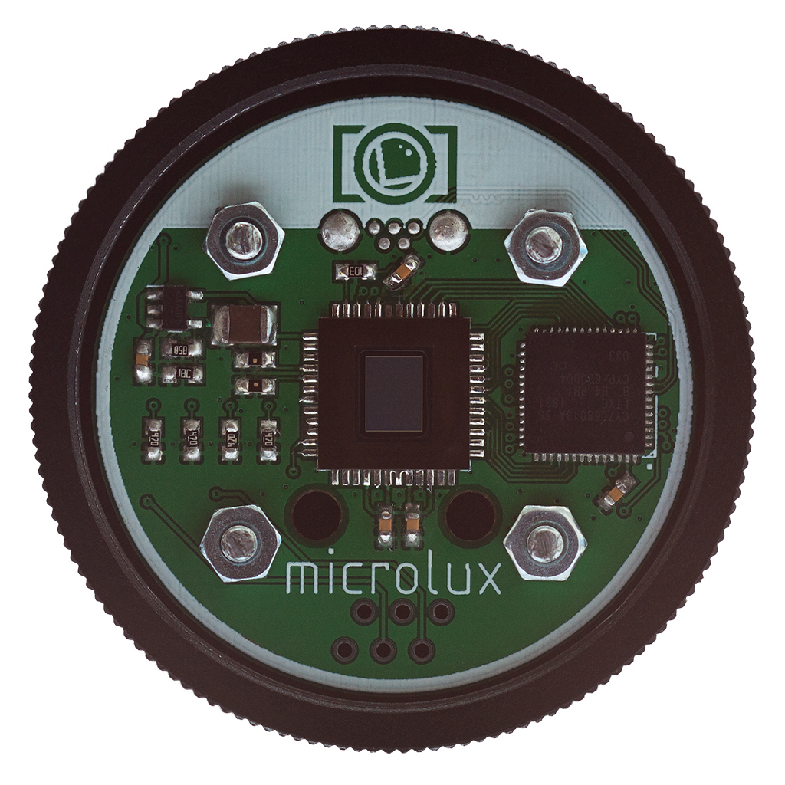
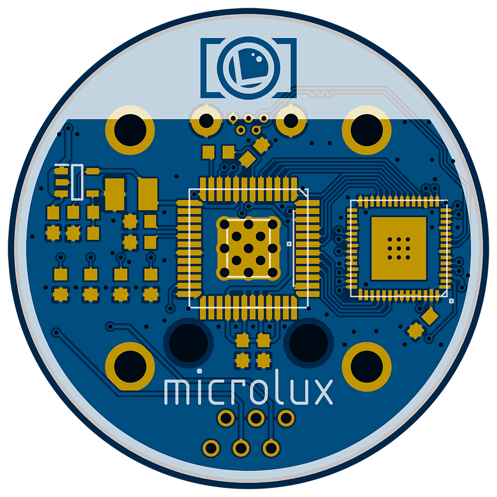

This project is still in development.

# microlux

microlux is an open source design for an astrophotography autoguiding camera designed around the Aptina AR0130 image sensor.

## Hardware specifications

* AR0130 image sensor in ILCC48 package
  * 1280x960 resolution
  * 1/3-inch (6mm) diagonal size
  * 3.75um pixels
  * 78% peak quantum efficiency

* CY7C68013A microcontroller in QFN56 package
  * High speed USB 2.0 (480Mb/s)
  * Quad buffered 16/8 bit FIFO

* 40mm circular PCB
  * Designed to fit inside T2 / 42mm dust cap
  * 4x mounting holes for M2.5 screws (20mm square spacing)
  * Micro USB connector
  * RJ12 connector for ST4-compatible autoguiding

## PCB fab capability requirements

* Min. trace width <= 6mil
* Min. trace/pad spacing <= 6mil
* Min. drill <= 0.35mm
* Max. drill >= 2.7mm
* Min. via diameter <= 0.6mm
* Min. copper thickness >= 1.37mil (1oz/ft2)
* PCB thickness 0.8-1.6mm

## PCB photo

## PCB render

